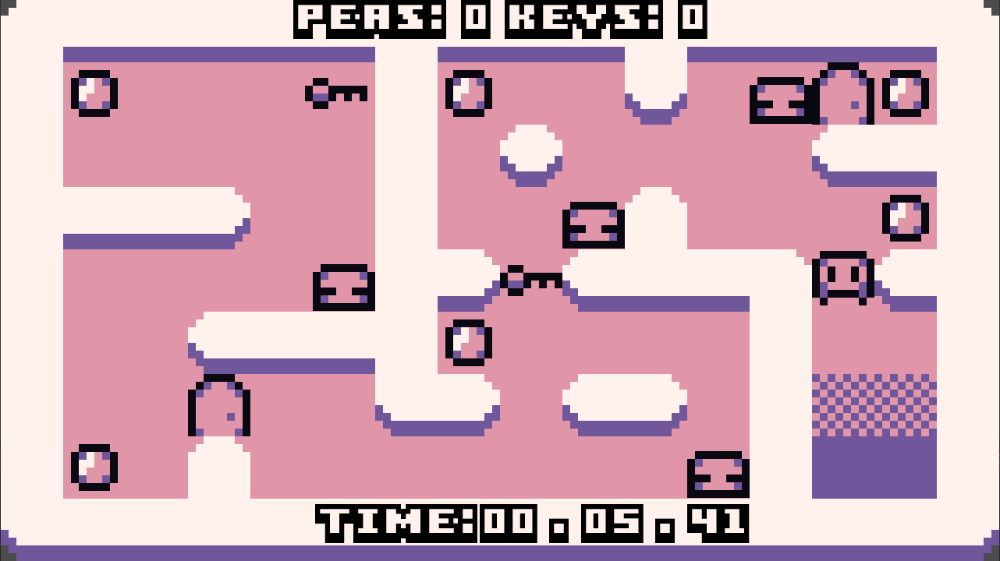

# Spoopy Blobs

---

## About

Simple game made in Godot 3.1

This game was made as a simple learning excerise. All code can be found within this repository.

Overall this should merely be used as reference and learning material. Most of the code and structure is probably not best practice, however thought those who are learning Godot may want to see it.

Play it here: https://defaultsound.itch.io/spoopy-blobs

---
## How to play

WASD - Move

Collect all the peas

Use the keys

Get back to the beginning to win

Avoid the Spoopy Blobs

---

## Resources

All assets either taken from https://opengameart.org/ or https://itch.io/ (Sorry I couldn't credit all, forgotten where some of the sounds/fonts came from)

Main Sprite Sheet: https://fisherg.itch.io/micro-asset-pack

Music: https://opengameart.org/content/happy-accident

